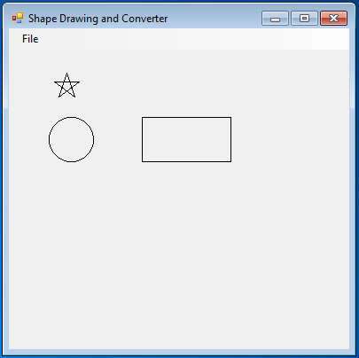
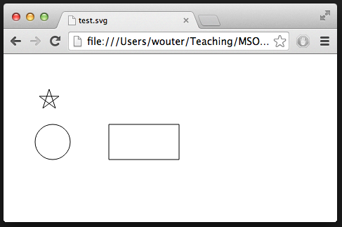
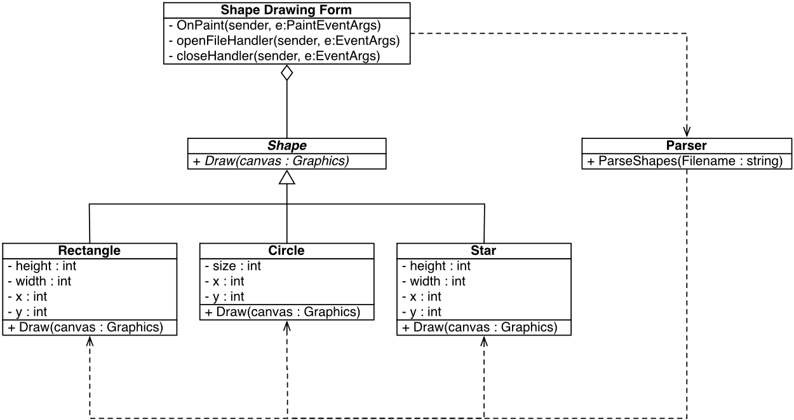

# MSO Lab Assignment IV

## Introduction
In this fourth exercise you will practice applying the Bridge pattern. The Shape Drawing program allows users to open an XML file. Here is one example snippet of the kind of file that the program can handle:
```
<shapes>
    <circle x="45" y="100" size="50"/>
    <rectangle x="150" y="100" height="50" width="100"/>
    <star x="50" y="50" width="30" height="30"/>
</shapes>
```
The Shape Drawing program proceeds to draw a circle, rectangle, and star. Here is a
screenshot of the result:



In this exercise, you will add a second kind of visualization: generating Scalable Vector Graphics (SVG) image showing the same shapes. SVG files are viewable in modern browsers. In the end, you should be able to produce both a C# drawing and the following SVG file:

```
<?xml version="1.0" standalone="no"?>
<!DOCTYPE svg PUBLIC "-//W3C//DTD SVG 1.1//EN"
    "http://www.w3.org/Graphics/SVG/1.1/DTD/svg11.dtd">
<svg xmlns="http://www.w3.org/2000/svg" version="1.1">
    <circle cx="70" cy="125" r="25" stroke-width="1" fill="none" stroke="black" />
    <polyline points="150,100 250,100 250,150 150,150 150,100"
        style="fill:none;stroke:black;stroke-width:1" />
    <polyline points="65,50 74,77 51,60 79,60 56,77 65,50"
        style="fill:none;stroke:black;stroke-width:1" />
</svg>
```

Try saving this text to a .svg file and opening that file in your browser. You should
see the same drawing as before:



There are lots of tutorials about SVG online, for example at [W3 Schools](https://www.w3schools.com/graphics/svg_intro.asp). 

Of course, this example is not too exciting – but similar problems occur all the time in real software, for example, when porting a game across different platforms, each with
different graphics libraries.

To do all this, you will need to refactor the original program and apply the Bridge pattern. Before starting this exercise, make sure you understand the Bridge pattern. If you have any questions, ask your lab assistants.

As you can imagine, the code to draw stars is not very easy. The solution you will write should not modify or duplicate this code. (Actually, you will need to make a few superficial modifications during the refactoring).

The point of this exercise is to learn to apply the Bridge pattern, and not to measure your SVG or programming skills. If you struggle with some of the technicalities with SVG, and you do not manage to generate an SVG file, then you can still pass this exercise, provided you clearly demonstrate that you understand the Bridge pattern and can apply it to improve the structure of this project.

## Design

The first part of this exercise is to design a solution and plan its implementation. The actual implementation work is all in the second part of this exercise. The current software has been designed as follows:



The `ShapeDrawingForm` is a Windows Form class, that sets up the GUI. It allows users to open a file using a dialog. This filename is passed to the parser. The parser then reads in the file and produces a list of shapes; these shapes are associated with `ShapeDrawingForm`. The `OnPaint` method defines an event handler, that when the window needs to be drawn, each shape in the list of shapes stored by the `ShapeDrawingForm` is drawn on screen.
In the first part of the exercise you must come up with a new design, using the Bridge pattern, that will facilitate the generation of SVG files.

### Part 1

Design a new version of the software, capable of generating SVG files. To do so, extend the UML class diagram above with new classes, as necessary. Based on this class diagram, it should be clear how the system you have designed will function, even if you have not implemented it yet. Be as precise as possible about the types of the various methods and attributes.

Focus on identifying the relevant classes and their relations relevant to the shape visualization. For each class, specify:
- the attributes associated with the class and the methods it supports;
- give a brief explanation of the abstract responsibilities assigned to every class;
- also briefly describe what the methods and attributes of every class should do.

### Part 2

Explicitly identify any design patterns that you have used. For each such pattern, explicitly state:
- the problem it addresses;
- how the design pattern has been applied. Be specific about the classes in your design that are associated with the design pattern.
- which alternatives did you consider?

You will be expected to at least use a Bridge pattern in the proposed design. Identify the relevant abstractions and implementations that the Bridge pattern decouples.

### Part 3
Evaluate your design. Explain how it solves the original problem, without duplicating the drawing logic of the individual `Shape` classes. What kind of extensions will be easy to handle? What kind of requirement changes would be difficult to incorporate in your new design?

### Part 4
Give a step-by-step refactoring plan describing how to implement your design. Describe any refactoring used, which classes to implement in which order, and so forth. You may want to look at some example descriptions of refactorings in
Martin Fowler’s book. (Note a whole catalogue of refactorings is available online, but the descriptions are rather short.) Explicitly mark points in the plan where the software should be compiled and tested.

### Part 5
Finally, implement the proposed refactoring, enabling the application to visualize shapes on screen and generate SVG files.

### Part 6
Finally, here are several bonus and verification questions to check your solution and explore further extensions.
1. Change the `numPoints` variable in the `Star` class from 5 to 3. Check that both the SVG code and C# drawings now produce triangles rather than stars.
2. Bonus exercises: Now that you have implemented the Bridge pattern, you can add new kinds of visualisation. For example, have a look at TikZ, a LATEX library that can be used to embed images in LATEX documents.
3. Harder bonus exercise: Add colors to the XML format and `Shape` class. Adapt your visualizations to support colors.

## Submission
Submit a .zip file, with a report describing your work using the template in the Appendix and a working implementation of the refactored system. Consult the course planning for the deadline.

## Taal
De opdracht mag zowel in het Engels als Nederlands worden gemaakt.

## Appendix: report format

### MSO Lab Exercise IV: Design and refactoring

| Student name    | Student id    |
|-----------------|---------------|
| <student1_name> | <student1_id> |
| <student2_name> | <student2_id> |

#### Design
Describe your proposed design and how it differs from the current design. Include a UML diagram of your design.
#### Design patterns
Describe the design patterns that you have used.
#### Evaluation
Evaluate your design.
#### Refactoring plan
Give a step-by-step plan for implementing your design.
#### Implementation
Describe your implementation, how well your intended refactoring plan worked, and any extensions that you implemented.
